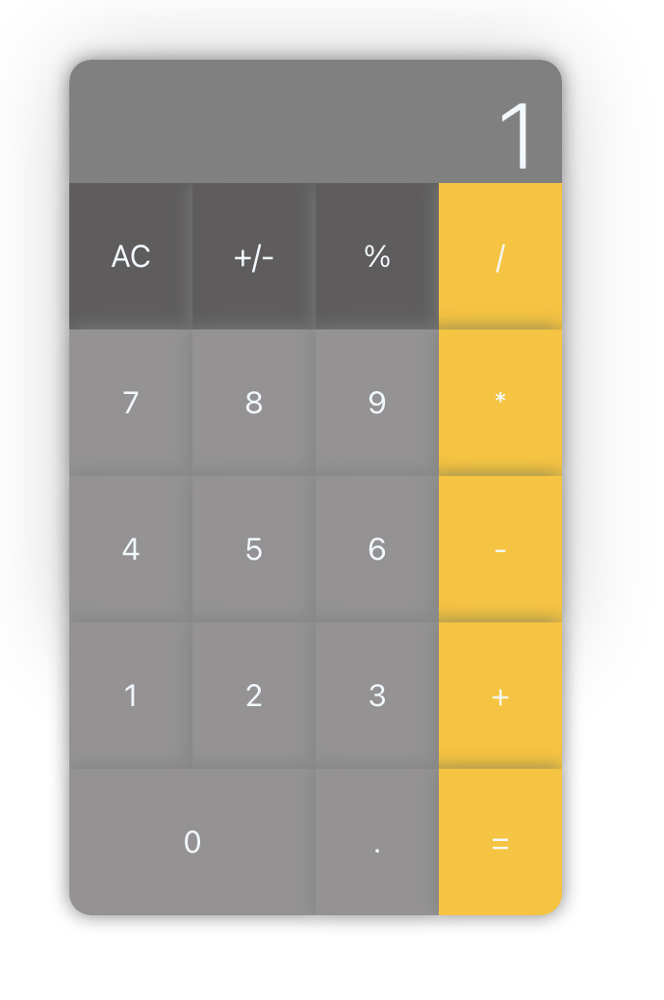

# Calculator Web App

A web calculator (Design inspired by apple default calculator tool)

## Enviroment Setup

node
npm

### Quick setup

```shell
npm install
npm start
```

## Project Requirement

no

#### Functional

- Basic Calculator operation

#### Non-Functional

- N/A

### Test UI input

N/A

### Tech stack

- React

### UI


